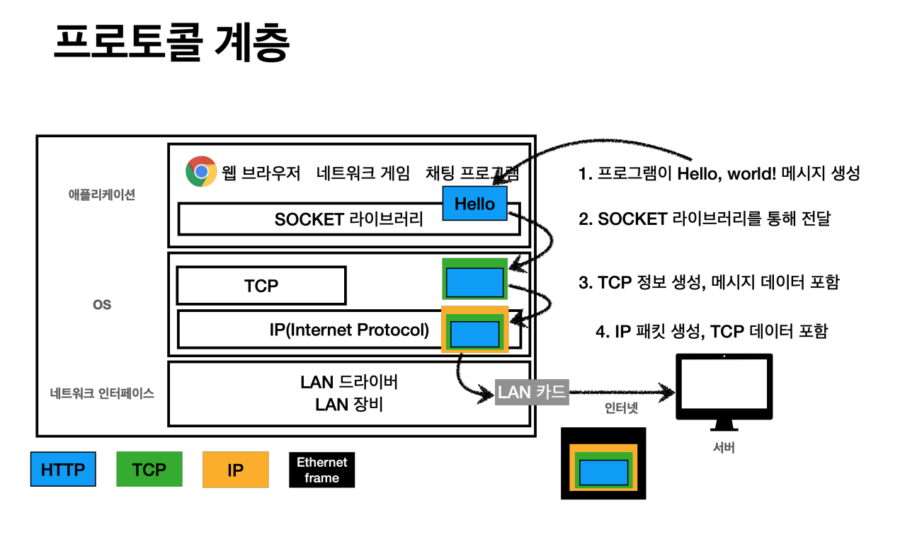
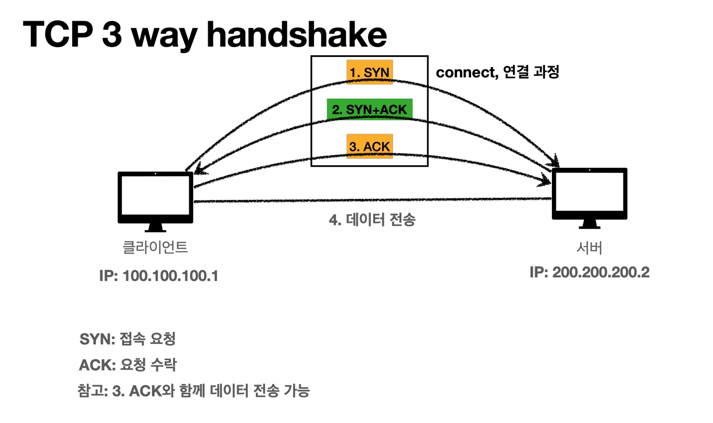

## 강의 정리

### 내용 요약

- IP 위에 TCP를 올려서 보완해준다.
- 하나씩 포장해 가면서 패킷이 완성됨
  
- TCP/IP 패킷 정보
    - 출발지 IP, 목적지 IP, 기타..
    - TCP 정보
        - 출발지 Port, 목적지 Port, 기타..
        - 이런 데이터들을 넣어서 IP 만으로 해결 안됐던 문제를 해결한다.
- TCP 특징
    - 연결 지향 - TCP 3 way handshake (가상 연결)
    - 데이터 전달 보증
    - 순서 보장
    - 신뢰할 수 있는 프로토콜
    - 현재는 대부분 TCP를 사용한다.
- TCP 3 way handshake
  
    - 서버와 클라이언트가 서로 연결을 맺을 때 사용하는 방법
    - 클라이언트가 Syn을 보내면 서버는 Syn, Ack로 응답하고, 클라이언트는 Ack를 보내면 연결이 완료된다.
- 데이터 전달 보증
    - 데이터 전송후 서버에서 데이터를 잘받았다고 알려준다.
- 순서 보장
    - 패킷을 1,2,3 순서로 보냈는데 1,3,2 순서로 도착했다면, 2부터 다시 요청후 2,3을 다시 받는다
        
- UDP(User Datagram Protocol) 특징
    - 하얀 도화지에 비유(기능이 거의 없음)
    - IP 와 거의 똑같지만 Port 정보만 추가된 정도(+체크섬)
        - 체크섬이란 데이터의 오류를 검출하기 위한 방법
    - TCP는 이미 모든 구축이 되어 최적화가 어렵기 때문에 UDP를 사용하기도 한다.
    - 최근에는 UDP가 HTTP3에서 최적화에 유리해 뜨고있다.