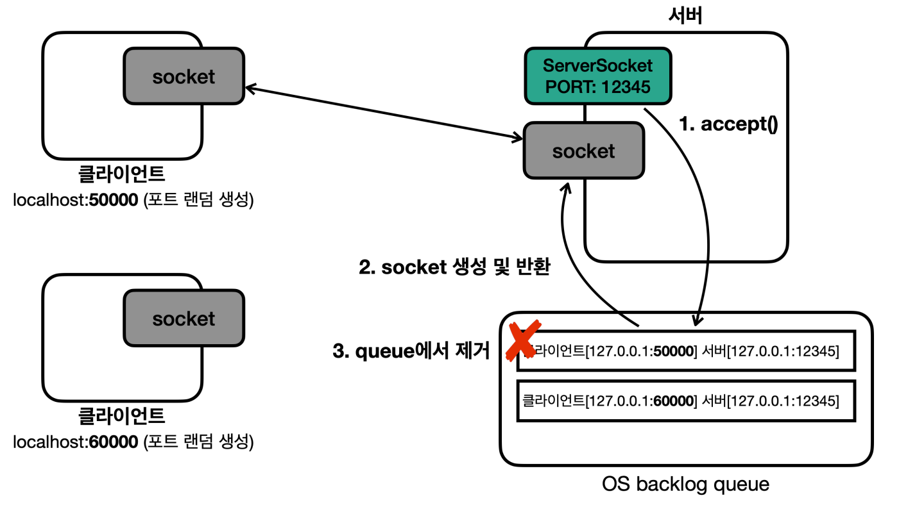
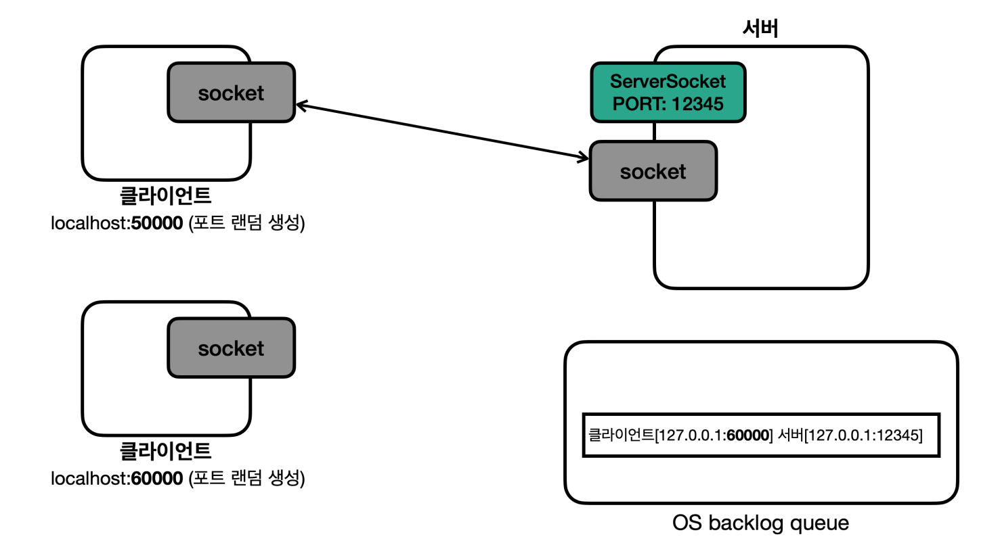

## 강의 정리

### 내용 요약

- 여러 클라이언트가 서버에 접속하는 경우
    - 첫번째 클라이언트가 먼저 서버에 접근해서 연결하면 백로그 큐에 연결 정보가 만들어진다.
    - 이때 OS 계층에서 3 way handshake 가 발생 TCP 연결 완료가 된다.
    - 이 시점에 클라이언트와 서버의 연결은 이미 완료가 된 상황이다.
    - 이때 새로운 클라이언트가 서버에 연결 요청을 하면 이 또한 연결이 된 후 새로운 백로그 큐가 생긴다.
    - 서버가 accept()로 밸로그 큐 정보를 기반으로 소켓 객체를 하나 생성한다.
    - 그럼 하나의 큐 정보는 백로그에 남아 있다.
    - 두번째 클라이언트도 이미 연결이 되어 있기때문에 메시지 자체는 보낼 수 있다.
    - 그러나 서버 어플리케이션에서 읽지 않기 떄문에 서버 OS의 TCP 수신 버퍼에서 대기 하게된다.
    - 여기서 핵심은 `소켓 객체 없이 서버 소켓만으로도 TCP 연결은 완료된다`는 것이다.
        - 하지만 연결 이후에 메시지를 주고 받으려면 소켓 객체가 필요하다.
- accept()는 이미 연결된 TCP 정보를 기반으로 소켓 객체를 생성한다.
    - 그리고 이 객체가 있어야 스트림을 사용해서 메시지를 주고 받을 수 있다.
- 결론은 accept()를 호출해서 객체가 계속 만들 수 있게해야한다.
- 서버 V2의 문제는 새로운 클라이언트가 접속했을떄 main스레드는 accept 메소드를 한번 호출 후 클라이언트의 문자를 받기위한 루프를 돌기에 새로운 객체를 만들 수 없다.
    - 즉 accept처리를 할 별도의 스레드가 필요하다.
    - accept만 할 스레드와 read만 할 스레드 두 개의 스레드를 만들어야 한다. 